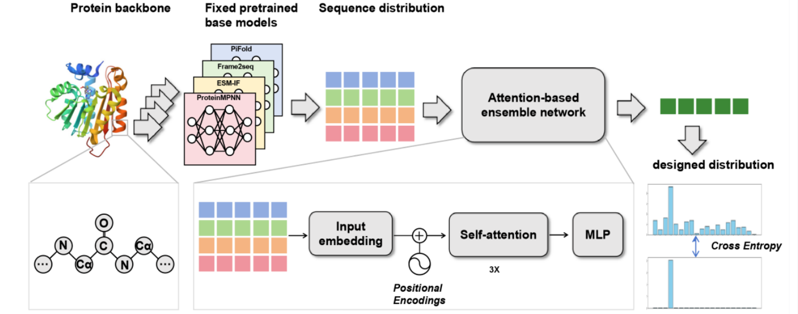

# CHIEF: An Attention-based Ensemble Learning Framework for Functional Protein Design


Official repository for CHIEF, an attention-based ensemble learning framework for protein design, as described in our preprint [here](https://www.biorxiv.org/content/10.1101/2025.03.07.641005v1).


<p align="center">
  
</p>


## 1. Setup

### 1.1. Clone the CHIEF repository

```bash
git clone --recursive https://github.com/ZoneGeng/CHIEF.git
```


### 1.2.Create conda envrionment
```bash
conda env create -f environment.yaml
conda activate chief
```
Then, Installing torch_scatter manually
The torch_scatter package provides precompiled wheels that must exactly match your PyTorch and CUDA version. It is not available directly from PyPI in the form torch-scatter==<version>+cuXXX. Instead, you need to install it from the official [PyG wheel index](https://pytorch-geometric.com/whl/)
.

### 1.3. Download model weights

To run CHIEF for protein sequence sampling, you will need the pretrained weights.  They can be downloaded from the following link:

[Download CHIEF Weights](https://drive.google.com/file/d/1e_eWliqpGVxq-mZ3yWeO9XReA1jjar00/view?usp=drive_link)

After downloading, unzip and replace the folder `./checkpoints` directory:

### 2. Sampling sequences from given PDB structure

```bash
python run_CHIEF.py \
  --pdb_path path_to_pdb \
  --out_fasta ./test/designed_sequence.fasta \
  --num_seqs 10
```